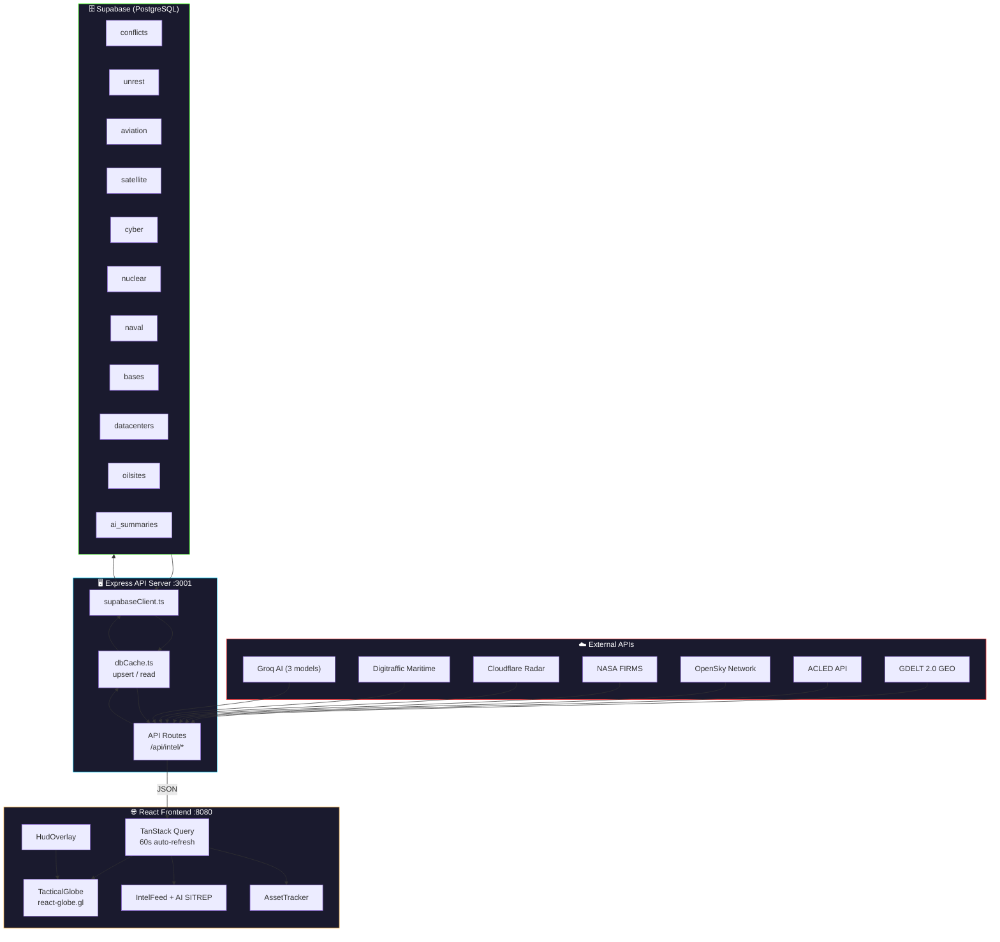
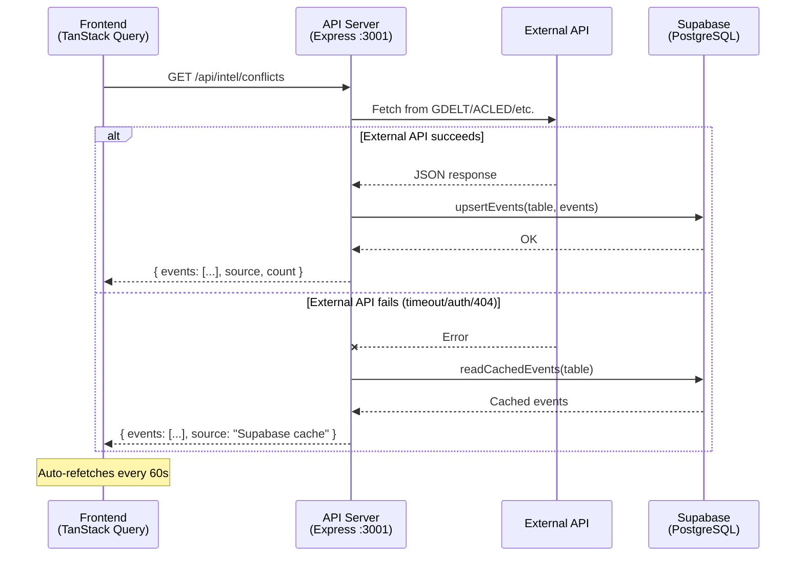
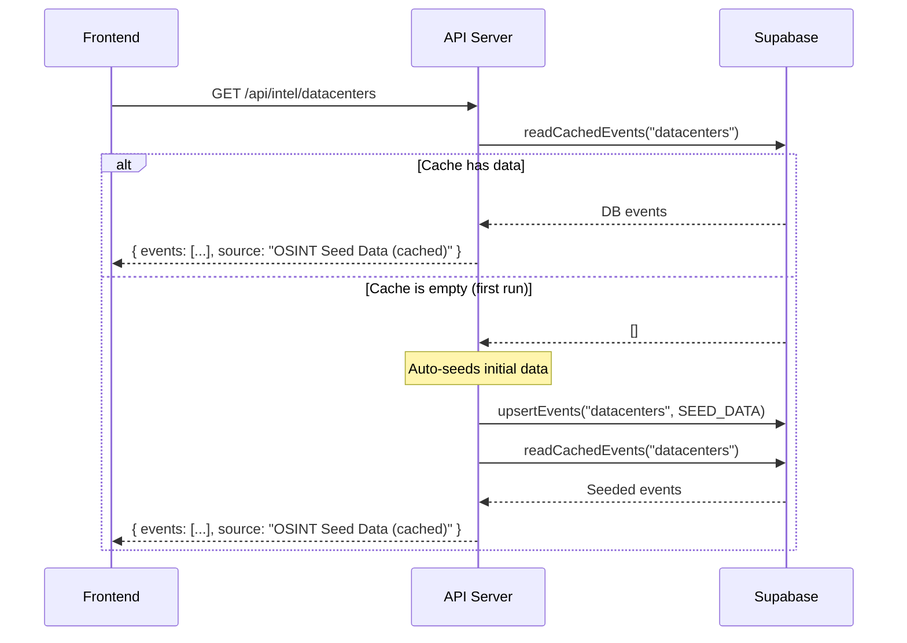
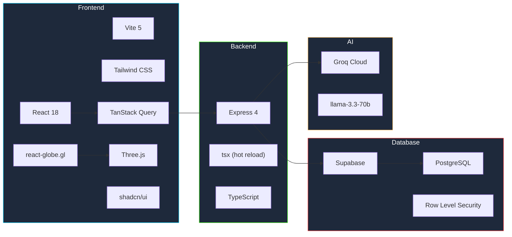
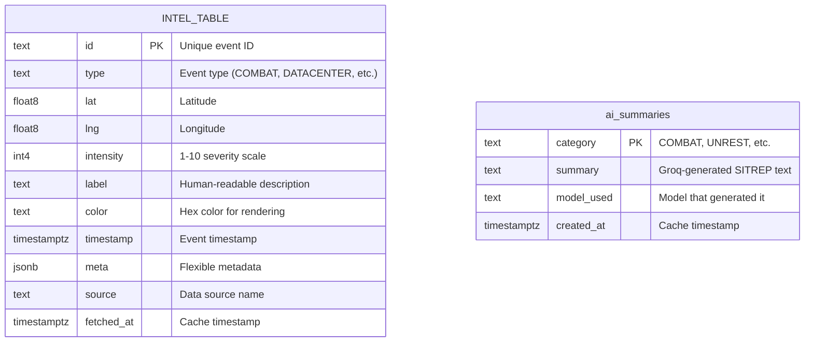
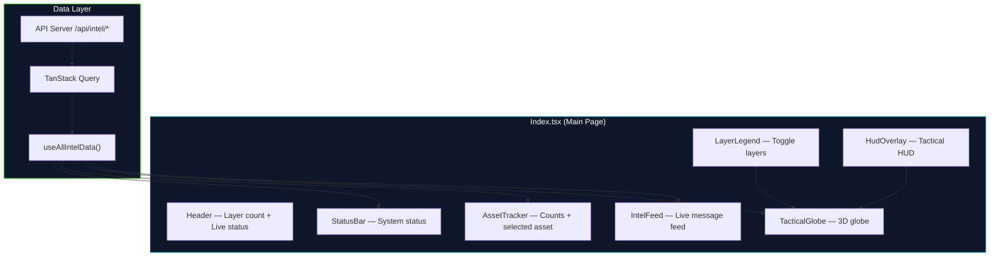

# Aerial Intel

**Global Command Center** — Real-time tactical intelligence, 3D globe visualization, and asset tracking powered by live data feeds, Supabase caching, and AI.

---

## Table of Contents

- [Architecture Overview](#architecture-overview)
- [Data Flow](#data-flow)
- [Project Structure](#project-structure)
- [Tech Stack](#tech-stack)
- [Quick Start](#quick-start)
- [Environment Variables](#environment-variables)
- [Supabase Setup](#supabase-setup)
- [API Endpoints](#api-endpoints)
- [Data Sources](#data-sources)
- [Frontend Components](#frontend-components)
- [API Status & Troubleshooting](#api-status--troubleshooting)
- [Features](#features)

---

## Architecture Overview



---

## Data Flow



### DB-Driven Routes (Datacenters, Oil Sites, Nuclear, Bases)

These layers use a **database-first** approach — data lives in Supabase and is auto-seeded on first request.



> **No external API required** for data centers, oil sites, bases, infrastructure, and nuclear layers. They use curated OSINT seed data stored in Supabase.

---

## Project Structure

```
aerial-intel/
├── README.md
├── api/                          # Express.js API proxy + Supabase cache
│   ├── .env                      # API keys & Supabase credentials
│   ├── package.json
│   ├── tsconfig.json
│   ├── supabase-migration.sql    # Database schema (10 tables + RLS)
│   └── src/
│       ├── server.ts             # Express app, CORS, route mounting
│       ├── types.ts              # Shared TypeScript types (12 event types)
│       ├── supabaseClient.ts     # Singleton Supabase client
│       ├── dbCache.ts            # upsertEvents() & readCachedEvents()
│       └── routes/
│           ├── conflicts.ts      # GDELT → /api/intel/conflicts
│           ├── unrest.ts         # ACLED → /api/intel/unrest
│           ├── aviation.ts       # OpenSky → /api/intel/aviation
│           ├── satellite.ts      # NASA FIRMS → /api/intel/satellite
│           ├── cyber.ts          # Cloudflare → /api/intel/cyber
│           ├── nuclear.ts        # Seed → /api/intel/nuclear
│           ├── naval.ts          # Digitraffic → /api/intel/naval
│           ├── bases.ts          # Seed → /api/intel/bases (99 bases)
│           ├── infrastructure.ts # Seed → /api/intel/infrastructure
│           ├── datacenters.ts    # DB-driven → /api/intel/datacenters
│           ├── oilsites.ts       # DB-driven → /api/intel/oilsites
│           ├── conflictZones.ts  # Groq AI → /api/intel/conflict-zones
│           ├── summarize.ts      # Groq AI → /api/intel/summarize
│           └── predict.ts        # Groq AI → /api/intel/predict
├── frontend/                     # React + Vite frontend
│   ├── package.json
│   ├── vite.config.ts            # Dev proxy → :3001
│   ├── tailwind.config.ts
│   └── src/
│       ├── App.tsx               # Router setup
│       ├── main.tsx              # Entry point + QueryClient
│       ├── pages/
│       │   └── Index.tsx         # Main page — orchestrates all panels
│       ├── hooks/
│       │   └── useIntelData.ts   # TanStack Query hooks for all endpoints
│       ├── data/
│       │   └── tacticalData.ts   # Layer colors, labels, types (12 layers)
│       └── components/
│           ├── TacticalGlobe.tsx  # 3D globe (react-globe.gl)
│           ├── IntelFeed.tsx      # Live intel feed + AI SITREP briefing
│           ├── AssetTracker.tsx   # Asset counts & selected asset info
│           ├── StatusBar.tsx      # Bottom status bar
│           ├── HudOverlay.tsx     # Tactical HUD overlay
│           ├── LayerLegend.tsx    # Layer toggle legend (12 layers)
│           ├── NavLink.tsx        # Navigation link component
│           ├── GlobeMarker.ts    # SVG marker definitions
│           ├── GlobeSprites.ts   # Canvas sprite rendering (12 icons)
│           └── ui/               # shadcn/ui components
└── backend/                      # Reserved for future services
```

---

## Tech Stack



| Layer | Technologies |
|-------|-------------|
| **Frontend** | React 18, TypeScript, Vite, Tailwind CSS, shadcn/ui, topojson-client |
| **3D Globe** | Three.js, react-globe.gl, custom canvas sprites, conflict zone polygons |
| **API Proxy** | Express.js, TypeScript, tsx (hot reload) |
| **Database** | Supabase (PostgreSQL), RLS policies, 10 intel tables + AI summaries |
| **AI** | Groq — llama-3.3-70b-versatile, mixtral-8x7b-32768, llama-3.1-8b-instant |
| **State** | TanStack React Query (60s auto-refresh) |
| **Maritime** | Digitraffic (Finnish Transport) live AIS tracking |

---

## Quick Start

```sh
# 1. Clone & install
git clone <repo-url>
cd aerial-intel

# 2. Set up the API server
cd api
cp .env.example .env        # Fill in your API keys (see Environment Variables)
npm install
npm run dev                  # Starts on port 3001

# 3. Set up the frontend (separate terminal)
cd frontend
npm install
npm run dev                  # Starts on port 8080, proxies /api → :3001

# 4. Set up Supabase (see Supabase Setup section)
# Run supabase-migration.sql in your Supabase SQL editor
```

---

## Environment Variables

Create `api/.env` with these keys:

```env
# ——— Supabase (REQUIRED) ———
SUPABASE_URL=https://your-project.supabase.co
SUPABASE_ANON_KEY=eyJhbGciOiJIUzI1NiIs...

# ——— External API Keys ———
ACLED_EMAIL=your@email.edu
ACLED_KEY=your-acled-key

OPENSKY_USER=your-username
OPENSKY_PASS=your-password

NASA_FIRMS_KEY=your-firms-key

CLOUDFLARE_RADAR_TOKEN=your-cf-token

GROQ_API_KEY=gsk_your-groq-key
```

---

## Supabase Setup

1. Create a free project at [supabase.com](https://supabase.com)
2. Go to **SQL Editor** and run the migration file:

```sql
-- File: api/supabase-migration.sql
-- Creates 8 tables: conflicts, unrest, aviation, satellite, cyber, nuclear, naval, bases
-- Each table has: id, type, lat, lng, intensity, label, color, timestamp, meta, source, fetched_at
-- RLS policies grant anon full CRUD access
-- Indexes on fetched_at for cache eviction
```

3. Copy your **Project URL** and **anon public key** from **Settings → API** into `api/.env`

### Database Schema

All 10 intel tables share an identical schema. The `meta` column is JSONB for flexible per-category data (callsign, heading, vessel type, operator, capacity, etc.).



**Tables:** `conflicts`, `unrest`, `aviation`, `satellite`, `cyber`, `nuclear`, `naval`, `bases`, `datacenters`, `oilsites`, `ai_summaries`

---

## API Endpoints

All endpoints return the unified `ApiResponse` schema:

```json
{
  "events": [
    {
      "id": "EVT-001",
      "type": "COMBAT",
      "lat": 50.45,
      "lng": 30.52,
      "intensity": 8,
      "label": "Artillery exchange near Kyiv",
      "color": "#FF3131",
      "timestamp": "2025-01-15T14:32:07Z",
      "meta": { "source": "GDELT" }
    }
  ],
  "source": "GDELT → Supabase",
  "count": 1
}
```

| Method | Endpoint | Source | Auth | Description |
|--------|----------|--------|------|-------------|
| `GET` | `/api/health` | — | None | Server status + endpoint list |
| `GET` | `/api/intel/conflicts` | GDELT 2.0 | None | Armed conflict events |
| `GET` | `/api/intel/unrest` | ACLED | Key | Protests, riots, civil unrest |
| `GET` | `/api/intel/aviation` | OpenSky | Optional | Live aircraft positions |
| `GET` | `/api/intel/satellite` | NASA FIRMS | Key | Thermal hotspots (fire/explosion) |
| `GET` | `/api/intel/cyber` | Cloudflare Radar | Token | Internet outages & anomalies |
| `GET` | `/api/intel/nuclear` | Supabase seed | None | Nuclear facility locations |
| `GET` | `/api/intel/naval` | Digitraffic + seed | None | Live vessel tracking + military seed |
| `GET` | `/api/intel/bases` | Supabase seed | None | 99 military bases across 43 countries |
| `GET` | `/api/intel/infrastructure` | Supabase seed | None | Submarine cables & pipelines (48 points, 23 routes) |
| `GET` | `/api/intel/datacenters` | Supabase (DB-driven) | None | 55 AI/cloud data centers worldwide |
| `GET` | `/api/intel/oilsites` | Supabase (DB-driven) | None | 56 oil fields, refineries & chokepoints |
| `GET` | `/api/intel/conflict-zones` | Groq AI | Key | AI-identified active conflict zone countries |
| `POST` | `/api/intel/summarize` | Groq AI | Key | AI SITREP briefing per category |
| `POST` | `/api/intel/predict` | Groq AI | Key | AI flight path prediction |

---

## Data Sources

### Live API Sources

| Category | API | Auth | Notes |
|----------|-----|------|-------|
| ⚔️ **Combat** | [GDELT 2.0 GEO API](https://api.gdeltproject.org) | Free, no key | Falls back to Supabase cache |
| 📢 **Unrest** | [ACLED API](https://acleddata.com) | Free .edu email | Falls back to Supabase cache |
| ✈️ **Aviation** | [OpenSky Network](https://opensky-network.org) | Optional (increases rate limit) | Auto-falls back to anonymous on 401 |
| 🛰️ **Satellite** | [NASA FIRMS](https://firms.modaps.eosdis.nasa.gov) | Free MAP_KEY | Falls back to Supabase cache |
| 📡 **Cyber** | [Cloudflare Radar](https://radar.cloudflare.com) | Free token | Falls back to Supabase cache |
| ⚓ **Naval** | [Digitraffic](https://meri.digitraffic.fi) | None | Live Baltic AIS + military seed (SOG >2kn, <2h) |

### Database-Driven Sources (no external API needed)

These layers auto-seed into Supabase on first request. Data can be managed directly in the database.

| Category | Data | Count |
|----------|------|-------|
| 🖥️ **Data Centers** | AI/cloud data centers (AWS, Google, Meta, NVIDIA, Alibaba, etc.) | 55 facilities |
| 🛢️ **Oil Sites** | Oil fields, refineries, terminals, offshore platforms, chokepoints | 56 sites |
| 🛡️ **Bases** | Military installations across 43 countries | 99 bases |
| 🔌 **Infrastructure** | Submarine cables & pipelines (points + arc routes) | 48 points, 23 routes |
| ☢️ **Nuclear** | Known nuclear facility coordinates | 12 sites |

### AI-Powered Features

| Feature | Provider | Model | Description |
|---------|----------|-------|-------------|
| 🤖 **Flight Prediction** | [Groq](https://console.groq.com) | llama-3.3-70b-versatile | AI flight path analysis |
| 📋 **AI SITREP Briefing** | Groq | Multi-model (3 models by category) | Per-category intelligence summary |
| 🗺️ **Conflict Zones** | Groq | llama-3.3-70b-versatile | AI-identified active war/civil conflict countries (rendered as polygons) |

#### AI Model Assignment

| Categories | Model | Rationale |
|-----------|-------|-----------|
| COMBAT, NUCLEAR, Conflict Zones | `llama-3.3-70b-versatile` | Complex geopolitical analysis |
| CYBER, AVIATION | `mixtral-8x7b-32768` | Technical pattern recognition |
| UNREST, SATELLITE, NAVAL, others | `llama-3.1-8b-instant` | Fast event summarization |

---

## Frontend Components



| Component | Purpose |
|-----------|---------|
| `TacticalGlobe` | 3D interactive globe with points, rings, arcs, conflict zone polygons, and custom canvas sprites |
| `IntelFeed` | Real-time scrolling feed of intel events + collapsible AI SITREP briefings per category |
| `AssetTracker` | Shows event counts per layer + details of selected asset |
| `LayerLegend` | 3-column grid of toggleable layer buttons (12 layers) |
| `HudOverlay` | Tactical heads-up display overlay on the globe |
| `StatusBar` | Footer showing layer counts and connection status |
| `GlobeMarker` | SVG icon definitions for each event category |
| `GlobeSprites` | Canvas-based Three.js sprite rendering for 12 category icons |

---

## API Status & Troubleshooting

### Current API Issues (as of testing)

| Endpoint | Error | Likely Cause | Fix |
|----------|-------|-------------|-----|
| `/intel/conflicts` | 502 (GDELT 404) | GDELT GEO endpoint may have moved | Check [GDELT docs](https://blog.gdeltproject.org/gdelt-geo-2-0-api-searching-the-world/) for updated URL |
| `/intel/unrest` | 400 (ACLED auth) | OAuth token format changed | Re-check [ACLED access](https://acleddata.com/acleddatanew/wp-content/uploads/2021/11/ACLED_APInstructions.pdf) |
| `/intel/aviation` | 401 (OpenSky) | Credentials rejected or rate limit | Register new account at [OpenSky](https://opensky-network.org/index.php/-/login) |
| `/intel/satellite` | Timeout | NASA FIRMS slow or key expired | Regenerate key at [FIRMS](https://firms.modaps.eosdis.nasa.gov/api/area/) |
| `/intel/cyber` | 400 (Cloudflare) | Token invalid or API v4 change | Create new token at [Cloudflare dashboard](https://dash.cloudflare.com/profile/api-tokens) |

> **Note:** When external APIs fail, the API server automatically falls back to reading cached data from Supabase. Data will still appear on the globe if it was previously fetched successfully.

### Suggested Free Military/OSINT APIs

| API | Category | Free? | Description |
|-----|----------|-------|-------------|
| [GDELT DOC API](https://api.gdeltproject.org/api/v2/doc/doc) | Conflicts | ✅ | Alternative GDELT endpoint — full-text search with geo extraction. More reliable than GEO API. |
| [ACLED Direct Export](https://acleddata.com/data-export-tool/) | Unrest | ✅ (with account) | CSV download instead of OAuth endpoint — simpler auth flow. |
| [ADS-B Exchange](https://www.adsbexchange.com/data/) | Aviation | ✅ (RapidAPI) | Community-driven aircraft tracking, free tier via RapidAPI. |
| [FlightAware AeroAPI](https://www.flightaware.com/aeroapi/) | Aviation | ✅ (limited) | Flight tracking with 500 free queries/month. |
| [NASA EONET](https://eonet.gsfc.nasa.gov/api/v3/events) | Satellite/Events | ✅ | Earth Observatory Natural Event Tracker — no key required. |
| [USGS Earthquake API](https://earthquake.usgs.gov/fdsnws/event/1/) | Seismic | ✅ | Real-time earthquake data — no key, JSON format. |
| [Global Terrorism Database](https://www.start.umd.edu/gtd/) | Terrorism | ✅ (academic) | Historical terrorism events with lat/lng. |
| [SIPRI Arms Transfers](https://armstrade.sipri.org/armstrade/page/values.php) | Military | ✅ | Arms transfer data between countries. |
| [Military Periscope](https://www.militaryperiscope.com/) | Bases/Assets | ✅ (limited) | Order of battle & equipment databases. |
| [MarineTraffic API](https://www.marinetraffic.com/en/ais-api-services) | Naval | ⚠️ Free trial | AIS vessel tracking (better than OpenShipData). |
| [Shodan](https://www.shodan.io/) | Cyber | ✅ (limited) | Internet-facing device scanner, good for cyber threat mapping. |

---

## Features

- 🌍 Interactive 3D tactical globe with animated canvas sprites, arcs, rings, and conflict zone polygons
- 📡 12 data layers: combat, unrest, aviation, naval, satellite, cyber, nuclear, bases, infrastructure, data centers, oil sites, danger
- 🗄️ Supabase (PostgreSQL) caching — data persists even when external APIs fail
- 🤖 Multi-model AI SITREP briefings per category (Groq — 3 models by domain)
- 🗺️ AI-identified conflict zone overlay (civil wars, insurgencies rendered as country polygons)
- ✈️ AI-powered flight path prediction
- ⚓ Live maritime tracking via Digitraffic AIS (SOG-filtered, recency-checked)
- 🛡️ 99 military bases across 43 countries with Pentagon command link arcs
- 🖥️ 55 AI/cloud data centers worldwide (database-driven, no API needed)
- 🛢️ 56 global oil sites including strategic chokepoints (database-driven)
- 🔌 Submarine cable & pipeline network with arc rendering (23 routes)
- 📊 Auto-refreshing data (60s intervals via TanStack Query)
- 🔒 Row Level Security on all Supabase tables
- ⚡ Hot module reload in dev (Vite frontend + tsx API server)

---

## License

MIT
