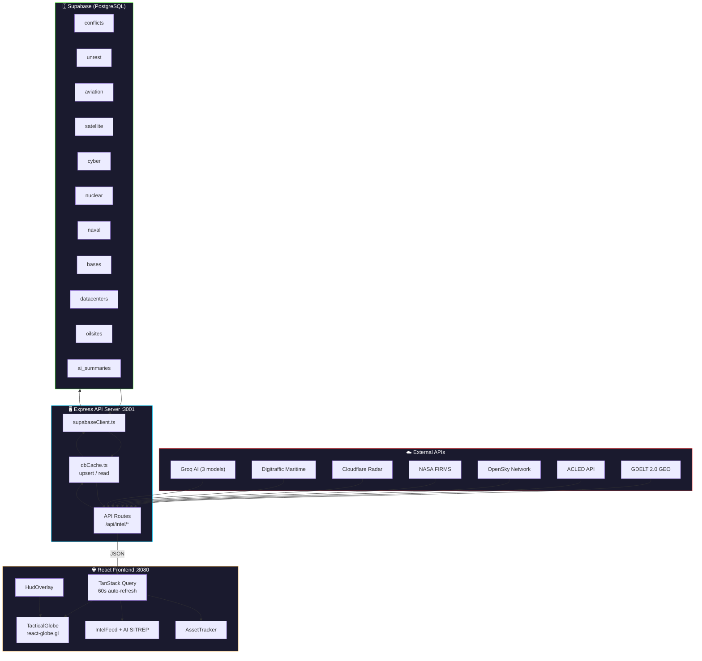
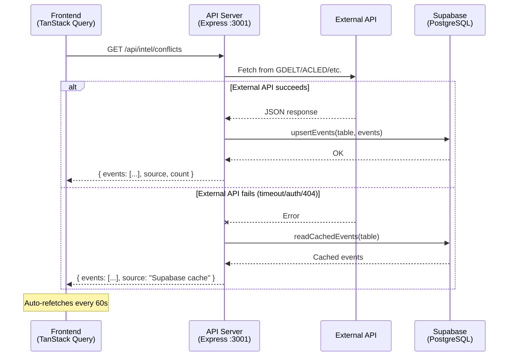
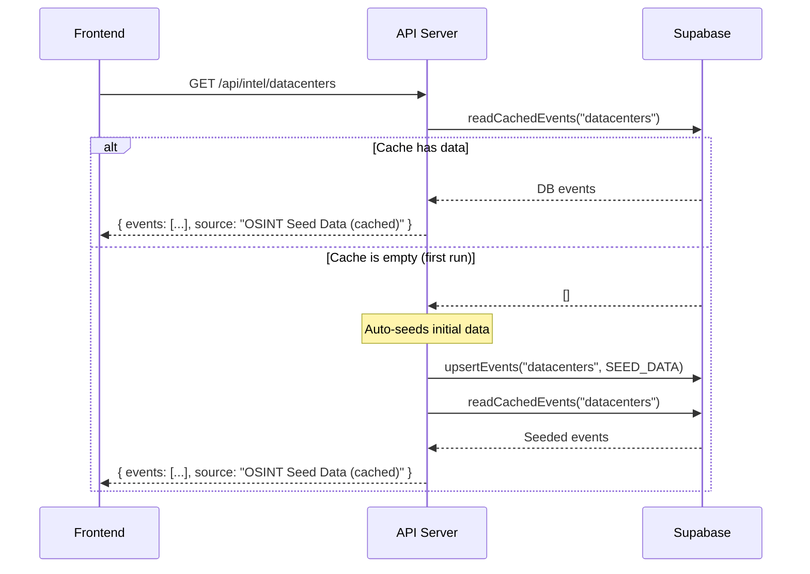
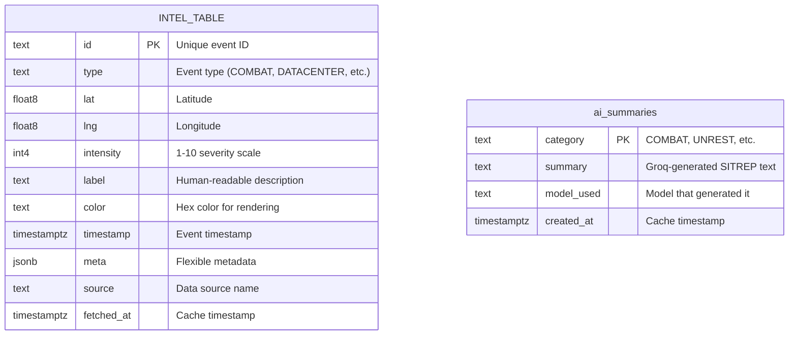
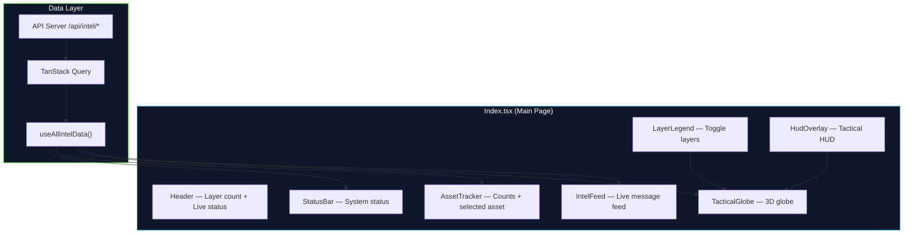

<div align="center">

# ⚡ AERIAL INTEL

### Global Command Center — Real-Time Tactical Intelligence

[](https://www.typescriptlang.org/)
[](https://react.dev/)
[](https://vitejs.dev/)
[](https://supabase.com/)
[](https://groq.com/)
[](LICENSE)

**A military-grade tactical intelligence dashboard built on a 3D interactive globe.**
Live conflict zones, aircraft, naval vessels, cyber threats, nuclear sites, and AI-generated SITREPs — all in one command center.

[**Live Demo**](https://aerial-intel.vercel.app) · [**API Docs**](#api-endpoints) · [**Quick Start**](#quick-start)

---

</div>

## Table of Contents

- [Features](#features)
- [Architecture Overview](#architecture-overview)
- [Data Flow](#data-flow)
- [Project Structure](#project-structure)
- [Tech Stack](#tech-stack)
- [Quick Start](#quick-start)
- [Environment Variables](#environment-variables)
- [Supabase Setup](#supabase-setup)
- [API Endpoints](#api-endpoints)
- [Data Sources](#data-sources)
- [Frontend Components](#frontend-components)
- [API Status & Troubleshooting](#api-status--troubleshooting)

---

## Features

<table>
<tr>
<td width="50%">

**🌍 3D Tactical Globe**
Interactive globe with animated canvas sprites, hex-bin layers, arcs, seismic rings, and AI-drawn conflict zone polygons

**📡 12 Live Intelligence Layers**
Combat · Unrest · Aviation · Naval · Satellite · Cyber · Nuclear · Bases · Infrastructure · Data Centers · Oil Sites · Danger

**🤖 Multi-Model AI Intelligence**
Groq-powered SITREPs, flight path prediction, and conflict zone analysis across 3 LLM models (70B / 8x7B / 8B)

**🗺️ Conflict Zone Polygons**
27 active war zones highlighted as country polygons with severity ratings, start dates, and real-time threat levels

</td>
<td width="50%">

**🗄️ Resilient Supabase Caching**
PostgreSQL-backed cache with Row Level Security — data persists and serves when all external APIs are down

**⚓ Live Maritime Tracking**
Digitraffic AIS with SOG-filter (>2 kn, <2h age) + 99-base military seed across 43 countries

**🛡️ 99 Military Bases**
Global military installations across 43 countries with animated Pentagon command link arcs

**⚡ 60-Second Auto-Refresh**
TanStack Query handles all cache-and-refetch cycles — no manual refresh ever needed

</td>
</tr>
</table>

---

## Architecture Overview



---

## Data Flow



### DB-Driven Routes (Datacenters, Oil Sites, Nuclear, Bases)

These layers use a **database-first** approach — data lives in Supabase and is auto-seeded on first request.



> **No external API required** for data centers, oil sites, bases, infrastructure, and nuclear layers. They use curated OSINT seed data stored in Supabase.

---

## Project Structure

```
aerial-intel/
├── README.md
├── api/                          # Express.js API proxy + Supabase cache
│   ├── .env                      # API keys & Supabase credentials
│   ├── package.json
│   ├── tsconfig.json
│   ├── supabase-migration.sql    # Database schema (10 tables + RLS)
│   └── src/
│       ├── server.ts             # Express app, CORS, route mounting
│       ├── types.ts              # Shared TypeScript types (12 event types)
│       ├── supabaseClient.ts     # Singleton Supabase client
│       ├── dbCache.ts            # upsertEvents() & readCachedEvents()
│       └── routes/
│           ├── conflicts.ts      # GDELT → /api/intel/conflicts
│           ├── unrest.ts         # ACLED → /api/intel/unrest
│           ├── aviation.ts       # OpenSky → /api/intel/aviation
│           ├── satellite.ts      # NASA FIRMS → /api/intel/satellite
│           ├── cyber.ts          # Cloudflare → /api/intel/cyber
│           ├── nuclear.ts        # Seed → /api/intel/nuclear
│           ├── naval.ts          # Digitraffic → /api/intel/naval
│           ├── bases.ts          # Seed → /api/intel/bases (99 bases)
│           ├── infrastructure.ts # Seed → /api/intel/infrastructure
│           ├── datacenters.ts    # DB-driven → /api/intel/datacenters
│           ├── oilsites.ts       # DB-driven → /api/intel/oilsites
│           ├── conflictZones.ts  # Groq AI → /api/intel/conflict-zones
│           ├── summarize.ts      # Groq AI → /api/intel/summarize
│           └── predict.ts        # Groq AI → /api/intel/predict
├── frontend/                     # React + Vite frontend
│   ├── package.json
│   ├── vite.config.ts            # Dev proxy → :3001
│   ├── tailwind.config.ts
│   └── src/
│       ├── App.tsx               # Router setup
│       ├── main.tsx              # Entry point + QueryClient
│       ├── pages/
│       │   └── Index.tsx         # Main page — orchestrates all panels
│       ├── hooks/
│       │   └── useIntelData.ts   # TanStack Query hooks for all endpoints
│       ├── data/
│       │   └── tacticalData.ts   # Layer colors, labels, types (12 layers)
│       └── components/
│           ├── TacticalGlobe.tsx  # 3D globe (react-globe.gl)
│           ├── IntelFeed.tsx      # Live intel feed + AI SITREP briefing
│           ├── AssetTracker.tsx   # Asset counts & selected asset info
│           ├── StatusBar.tsx      # Bottom status bar
│           ├── HudOverlay.tsx     # Tactical HUD overlay
│           ├── LayerLegend.tsx    # Layer toggle legend (12 layers)
│           ├── NavLink.tsx        # Navigation link component
│           ├── GlobeMarker.ts    # SVG marker definitions
│           ├── GlobeSprites.ts   # Canvas sprite rendering (12 icons)
│           └── ui/               # shadcn/ui components
└── backend/                      # Reserved for future services
```

---

## Tech Stack

<div align="center">

| Layer | Technologies |
|:------|:-------------|
| 🖥️ **Frontend** | React 18 · TypeScript · Vite 5 · Tailwind CSS · shadcn/ui · topojson-client |
| 🌐 **3D Globe** | Three.js · react-globe.gl · custom canvas sprites · conflict zone polygons |
| 🔌 **API Server** | Express.js · TypeScript · tsx (hot reload) |
| 🗄️ **Database** | Supabase · PostgreSQL · Row Level Security · 10 intel tables |
| 🤖 **AI Models** | Groq · `llama-3.3-70b-versatile` · `mixtral-8x7b-32768` · `llama-3.1-8b-instant` |
| 🔄 **State / Cache** | TanStack React Query · 60 s auto-refresh · Supabase fallback |
| ⚓ **Maritime** | Digitraffic AIS (Finnish Transport Infrastructure) |

</div>

---

## Quick Start

> **Prerequisites:** Node.js 18+, a free [Supabase](https://supabase.com) project, and a free [Groq](https://console.groq.com) API key.

**Step 1 — Clone the repository**
```sh
git clone https://github.com/your-username/aerial-intel.git
cd aerial-intel
```

**Step 2 — Configure the API server**
```sh
cd api
cp .env.example .env   # Add your API keys — see Environment Variables below
npm install
npm run dev            # API starts on http://localhost:3001
```

**Step 3 — Start the frontend** *(separate terminal)*
```sh
cd frontend
npm install
npm run dev            # App starts on http://localhost:8080 (proxies /api → :3001)
```

**Step 4 — Seed Supabase**
```sh
# In your Supabase project → SQL Editor → paste and run:
# api/supabase-migration.sql
# This creates all 10 intel tables with RLS policies.
```

Open `http://localhost:8080` — the globe loads immediately. Supabase auto-seeds on first request for database-driven layers.

---

## Environment Variables

Create `api/.env` with these keys:

```env
# ——— Supabase (REQUIRED) ———
SUPABASE_URL=https://your-project.supabase.co
SUPABASE_ANON_KEY=eyJhbGciOiJIUzI1NiIs...

# ——— External API Keys ———
ACLED_EMAIL=your@email.edu
ACLED_KEY=your-acled-key

OPENSKY_USER=your-username
OPENSKY_PASS=your-password

NASA_FIRMS_KEY=your-firms-key

CLOUDFLARE_RADAR_TOKEN=your-cf-token

GROQ_API_KEY=gsk_your-groq-key
```

---

## Supabase Setup

1. Create a free project at [supabase.com](https://supabase.com)
2. Go to **SQL Editor** and run the migration file:

```sql
-- File: api/supabase-migration.sql
-- Creates 8 tables: conflicts, unrest, aviation, satellite, cyber, nuclear, naval, bases
-- Each table has: id, type, lat, lng, intensity, label, color, timestamp, meta, source, fetched_at
-- RLS policies grant anon full CRUD access
-- Indexes on fetched_at for cache eviction
```

3. Copy your **Project URL** and **anon public key** from **Settings → API** into `api/.env`

### Database Schema

All 10 intel tables share an identical schema. The `meta` column is JSONB for flexible per-category data (callsign, heading, vessel type, operator, capacity, etc.).



**Tables:** `conflicts`, `unrest`, `aviation`, `satellite`, `cyber`, `nuclear`, `naval`, `bases`, `datacenters`, `oilsites`, `ai_summaries`

---

## API Endpoints

All endpoints return the unified `ApiResponse` schema:

```json
{
  "events": [
    {
      "id": "EVT-001",
      "type": "COMBAT",
      "lat": 50.45,
      "lng": 30.52,
      "intensity": 8,
      "label": "Artillery exchange near Kyiv",
      "color": "#FF3131",
      "timestamp": "2025-01-15T14:32:07Z",
      "meta": { "source": "GDELT" }
    }
  ],
  "source": "GDELT → Supabase",
  "count": 1
}
```

| Method | Endpoint | Source | Auth | Description |
|--------|----------|--------|------|-------------|
| `GET` | `/api/health` | — | None | Server status + endpoint list |
| `GET` | `/api/intel/conflicts` | GDELT 2.0 | None | Armed conflict events |
| `GET` | `/api/intel/unrest` | ACLED | Key | Protests, riots, civil unrest |
| `GET` | `/api/intel/aviation` | OpenSky | Optional | Live aircraft positions |
| `GET` | `/api/intel/satellite` | NASA FIRMS | Key | Thermal hotspots (fire/explosion) |
| `GET` | `/api/intel/cyber` | Cloudflare Radar | Token | Internet outages & anomalies |
| `GET` | `/api/intel/nuclear` | Supabase seed | None | Nuclear facility locations |
| `GET` | `/api/intel/naval` | Digitraffic + seed | None | Live vessel tracking + military seed |
| `GET` | `/api/intel/bases` | Supabase seed | None | 99 military bases across 43 countries |
| `GET` | `/api/intel/infrastructure` | Supabase seed | None | Submarine cables & pipelines (48 points, 23 routes) |
| `GET` | `/api/intel/datacenters` | Supabase (DB-driven) | None | 55 AI/cloud data centers worldwide |
| `GET` | `/api/intel/oilsites` | Supabase (DB-driven) | None | 56 oil fields, refineries & chokepoints |
| `GET` | `/api/intel/conflict-zones` | Groq AI | Key | AI-identified active conflict zone countries |
| `POST` | `/api/intel/summarize` | Groq AI | Key | AI SITREP briefing per category |
| `POST` | `/api/intel/predict` | Groq AI | Key | AI flight path prediction |

---

## Data Sources

### Live API Sources

| Category | API | Auth | Notes |
|----------|-----|------|-------|
| ⚔️ **Combat** | [GDELT 2.0 GEO API](https://api.gdeltproject.org) | Free, no key | Falls back to Supabase cache |
| 📢 **Unrest** | [ACLED API](https://acleddata.com) | Free .edu email | Falls back to Supabase cache |
| ✈️ **Aviation** | [OpenSky Network](https://opensky-network.org) | Optional (increases rate limit) | Auto-falls back to anonymous on 401 |
| 🛰️ **Satellite** | [NASA FIRMS](https://firms.modaps.eosdis.nasa.gov) | Free MAP_KEY | Falls back to Supabase cache |
| 📡 **Cyber** | [Cloudflare Radar](https://radar.cloudflare.com) | Free token | Falls back to Supabase cache |
| ⚓ **Naval** | [Digitraffic](https://meri.digitraffic.fi) | None | Live Baltic AIS + military seed (SOG >2kn, <2h) |

### Database-Driven Sources (no external API needed)

These layers auto-seed into Supabase on first request. Data can be managed directly in the database.

| Category | Data | Count |
|----------|------|-------|
| 🖥️ **Data Centers** | AI/cloud data centers (AWS, Google, Meta, NVIDIA, Alibaba, etc.) | 55 facilities |
| 🛢️ **Oil Sites** | Oil fields, refineries, terminals, offshore platforms, chokepoints | 56 sites |
| 🛡️ **Bases** | Military installations across 43 countries | 99 bases |
| 🔌 **Infrastructure** | Submarine cables & pipelines (points + arc routes) | 48 points, 23 routes |
| ☢️ **Nuclear** | Known nuclear facility coordinates | 12 sites |

### AI-Powered Features

| Feature | Provider | Model | Description |
|---------|----------|-------|-------------|
| 🤖 **Flight Prediction** | [Groq](https://console.groq.com) | llama-3.3-70b-versatile | AI flight path analysis |
| 📋 **AI SITREP Briefing** | Groq | Multi-model (3 models by category) | Per-category intelligence summary |
| 🗺️ **Conflict Zones** | Groq | llama-3.3-70b-versatile | AI-identified active war/civil conflict countries (rendered as polygons) |

#### AI Model Assignment

| Categories | Model | Rationale |
|-----------|-------|-----------|
| COMBAT, NUCLEAR, Conflict Zones | `llama-3.3-70b-versatile` | Complex geopolitical analysis |
| CYBER, AVIATION | `mixtral-8x7b-32768` | Technical pattern recognition |
| UNREST, SATELLITE, NAVAL, others | `llama-3.1-8b-instant` | Fast event summarization |

---

## Frontend Components



| Component | Purpose |
|-----------|---------|
| `TacticalGlobe` | 3D interactive globe with points, rings, arcs, conflict zone polygons, and custom canvas sprites |
| `IntelFeed` | Real-time scrolling feed of intel events + collapsible AI SITREP briefings per category |
| `AssetTracker` | Shows event counts per layer + details of selected asset |
| `LayerLegend` | 3-column grid of toggleable layer buttons (12 layers) |
| `HudOverlay` | Tactical heads-up display overlay on the globe |
| `StatusBar` | Footer showing layer counts and connection status |
| `GlobeMarker` | SVG icon definitions for each event category |
| `GlobeSprites` | Canvas-based Three.js sprite rendering for 12 category icons |

---

## API Status & Troubleshooting

### Current API Issues (as of testing)

| Endpoint | Error | Likely Cause | Fix |
|----------|-------|-------------|-----|
| `/intel/conflicts` | 502 (GDELT 404) | GDELT GEO endpoint may have moved | Check [GDELT docs](https://blog.gdeltproject.org/gdelt-geo-2-0-api-searching-the-world/) for updated URL |
| `/intel/unrest` | 400 (ACLED auth) | OAuth token format changed | Re-check [ACLED access](https://acleddata.com/acleddatanew/wp-content/uploads/2021/11/ACLED_APInstructions.pdf) |
| `/intel/aviation` | 401 (OpenSky) | Credentials rejected or rate limit | Register new account at [OpenSky](https://opensky-network.org/index.php/-/login) |
| `/intel/satellite` | Timeout | NASA FIRMS slow or key expired | Regenerate key at [FIRMS](https://firms.modaps.eosdis.nasa.gov/api/area/) |
| `/intel/cyber` | 400 (Cloudflare) | Token invalid or API v4 change | Create new token at [Cloudflare dashboard](https://dash.cloudflare.com/profile/api-tokens) |

> **Note:** When external APIs fail, the API server automatically falls back to reading cached data from Supabase. Data will still appear on the globe if it was previously fetched successfully.

### Suggested Free Military/OSINT APIs

| API | Category | Free? | Description |
|-----|----------|-------|-------------|
| [GDELT DOC API](https://api.gdeltproject.org/api/v2/doc/doc) | Conflicts | ✅ | Alternative GDELT endpoint — full-text search with geo extraction. More reliable than GEO API. |
| [ACLED Direct Export](https://acleddata.com/data-export-tool/) | Unrest | ✅ (with account) | CSV download instead of OAuth endpoint — simpler auth flow. |
| [ADS-B Exchange](https://www.adsbexchange.com/data/) | Aviation | ✅ (RapidAPI) | Community-driven aircraft tracking, free tier via RapidAPI. |
| [FlightAware AeroAPI](https://www.flightaware.com/aeroapi/) | Aviation | ✅ (limited) | Flight tracking with 500 free queries/month. |
| [NASA EONET](https://eonet.gsfc.nasa.gov/api/v3/events) | Satellite/Events | ✅ | Earth Observatory Natural Event Tracker — no key required. |
| [USGS Earthquake API](https://earthquake.usgs.gov/fdsnws/event/1/) | Seismic | ✅ | Real-time earthquake data — no key, JSON format. |
| [Global Terrorism Database](https://www.start.umd.edu/gtd/) | Terrorism | ✅ (academic) | Historical terrorism events with lat/lng. |
| [SIPRI Arms Transfers](https://armstrade.sipri.org/armstrade/page/values.php) | Military | ✅ | Arms transfer data between countries. |
| [Military Periscope](https://www.militaryperiscope.com/) | Bases/Assets | ✅ (limited) | Order of battle & equipment databases. |
| [MarineTraffic API](https://www.marinetraffic.com/en/ais-api-services) | Naval | ⚠️ Free trial | AIS vessel tracking (better than OpenShipData). |
| [Shodan](https://www.shodan.io/) | Cyber | ✅ (limited) | Internet-facing device scanner, good for cyber threat mapping. |

---

## License

Distributed under the **MIT License**. See [`LICENSE`](LICENSE) for details.

---

<div align="center">

Built with ☕ for **ICT241** — Alobin · 2026

</div>
